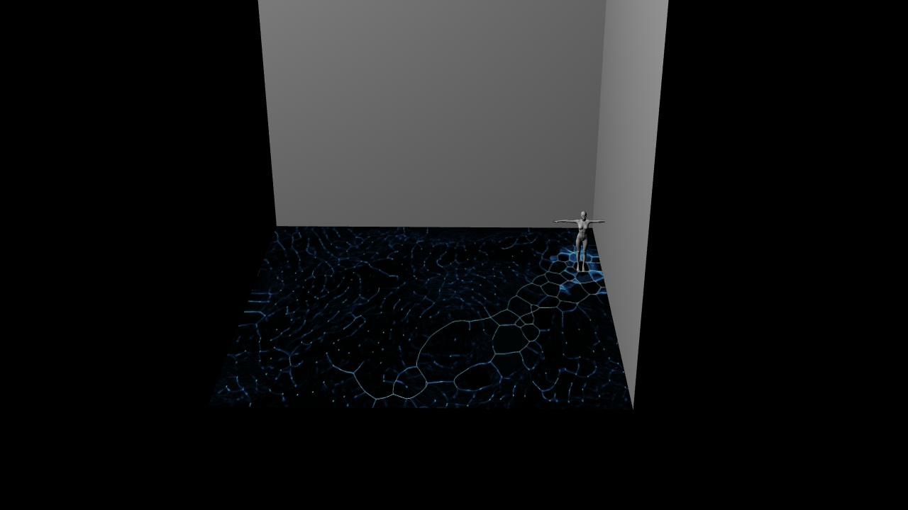

# Prototype to Performance
## Envisioning An Experience For Everyone
 type here.
 
## From Pixels To A Prototype
### Finding A Purpose for our Prototype
 type here.
 
### Design Taxonomy
  * **Crowd Participation**
    * Increased number of users enhances or creates an increased physical, emotional, media/computational response.  
       
### Area of Focus
  * **Media Architecture**
    * Computational display systems incorporated into the physical landscape including screens, lights, projection mapping and tracking.
    
### Sensory Environment:
  * **Visual Graphic**
    * 2D physical imaging technologies that use pigment or found objewcts, including priting, painting and mixed media.  
  * **Visual: Light**
    * Eminating or luminating a light source.
  * **Visual: Distortion**
    * Intentionally or randomly affecting the pattern of a series or sequence or light, pixels or images.  
  * **Visual: Projection**
    * Casting or throwing light from a source to a surface.  
  * **Sound: Distortion / Generation** 
    * Intentionally or randomly affecting the pattern of, or creating an audio wave or series.  
    
### BodyStorming
  * **Interactive Environments**
    * The idea is to have multiple controllers as "keys" in a walking exhibit or installation.  Whenever the user presses the button on their microcontroller it changes the environment around them, but not for everyone else.  
  * **Projection Mapping**
    * A projection mapped visual onto the ground.  When users walk onto the projection their position is tracked.  Pressing a button controls an aspect of the projection.  Could require multiple people.  
  * **Crowd Generated Music/Sound**
    * A collective crowd generated 
    
    ## Bodystorming
    
    Typing Words.
    
## Prototype 1.0

The visuals below are captured from a real time 3D rendering of our prototype made exclusively in TouchDesigner.  

You can view a video preview of our visualized prototype 1.0 here : [Prototype One](https://www.youtube.com/watch?v=RlnMgWQJlpA&feature=youtu.be)

> The first prototype is a live demonstration of our concept, including the interaction between the Feather Huzzah and TouchDesigner.  By connecting to the Adafruit IO api, it is possible to stream the data directly from the api into touchdesigner as JSON format, and parse the information directly inside Touchdesigner.  Because of this It is possible for us to use the live input from the feather huzzah to control aspects of the touchdesigner visual.  In this prototype Michael's button changes the colour of the projection, while William's button effects the complexity and detail of the projected visual.    

## Options For Our Interactions
### Powering A Pixel Perfect Performance 
* **TouchDesigner**
    * TouchDesigner is the best tool to use as a base platform for our Interaction.  It can easily be integrate with existing systems, such as web API's, DMX512, or databases but also has support for sensors such as the Microsoft Kinect, or streaming serial data from Microcontrollers such as the feather huzzah, or the teensy.  Touchdesigner is not only a great tool for creating immersive interactive environments because of its ability to be integrated with many existing systems and sensors, but it is also a very good prototyping tool for creating proof of concepts.  This allowed us to develope and test a visualization of our concept and validate its effectiveness.  
* **Feather Huzzah**
    * The feather huzzah ESP8266 is the best option we have access to right now.  
* **Teensy 4.0**
    * The teensy could possibly be another microcontroller to test in the future.  
* **[MQTT](https://mqtt.org/)**
    * The idea is to have multiple
* **[Socket.IO](https://socket.io/)**
    * The idea is to have multiple
* **[Dweet.io](https://mqtt.org/)**
    * The idea is to have multiple
* **[Data To mySQL Via ES8266](https://theiotprojects.com/insert-data-into-mysql-database-with-esp8266/)**
    * The idea is to have multiple

## Prototype 1.1
### Coming soon!
Enjoy this preview for now.  [Prototype 1.1](https://www.youtube.com/watch?v=__j6FiRErwo&feature=youtu.be)
