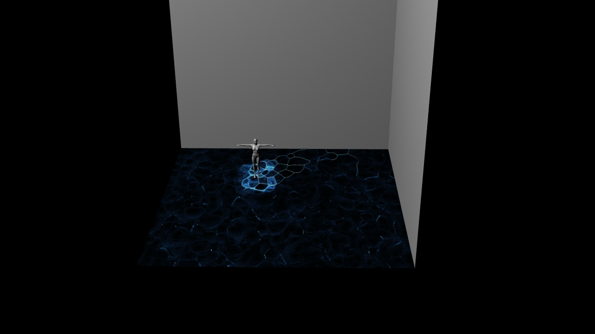

# Prototype to Performance
## Envisioning An Experience For Everyone
 This project will build on the skills and methods of physical computing by developing their project 2 prototypes by envisioning the possible interactions of their physical computing and sensors they explored.  Using the Design Matrix, students are encouraged to either continue developing their work on thier project 2 prototypes or pivot in a new direction.  The focus is to envision the possibilities of the prototypes, their function and the interactions with users.  
In this case study Michael Brzuchalski and William Luk revisit the two-way remote communication button they developed for project 2 in order to investigate the possibilities and technical limitations of advancing it further.  Due to the COVID-19 Pandemic, in person developement of physical group ideation and prototyping was not possible.  All ideation, prototyping and bodystorming was substituted or simulated online.   
 
## From Pixels To A Prototype
### Finding A Purpose For A Prototype
In the previous project Michael And William developed a two way form of communication using the Adafruit ESP8266 Feather Huzzah, Adafruit IO, and P5.js to trigger an onscreen change in a p5 sketch with a button press.  Building on this discovery and developement, the team used the provided Design Matrix as a guideline to generate new ways to incorporate their previous knowledge into new forms of sophisticated physical computing projects.  
 
### Design Taxonomy
  * **Crowd Participation**
    * Increased number of users enhances or creates an increased physical, emotional, media/computational response.  
       
### Area of Focus
  * **Media Architecture**
    * Computational display systems incorporated into the physical landscape including screens, lights, projection mapping and tracking.
    
### Sensory Environment:
  * **Visual Graphic**
    * 2D physical imaging technologies that use pigment or found objewcts, including priting, painting and mixed media.  
  * **Visual: Light**
    * Eminating or luminating a light source.
  * **Visual: Distortion**
    * Intentionally or randomly affecting the pattern of a series or sequence or light, pixels or images.  
  * **Visual: Projection**
    * Casting or throwing light from a source to a surface.  
  * **Sound: Distortion / Generation** 
    * Intentionally or randomly affecting the pattern of, or creating an audio wave or series.  
    
### Brainstorming and Bodystorming
  * **Interactive Environments**
    * The idea is to have multiple controllers as "keys" in a walking exhibit or installation.  Whenever the user presses the button on their microcontroller it changes the environment around them, but not for everyone else.  
  * **Projection Mapping**
    * A projection mapped visual onto the ground.  When users walk onto the projection their position is tracked.  Pressing a button controls an aspect of the projection.  Could require multiple people.  
  * **Crowd Generated Music/Sound**
    * A collective crowd generated 
    
## Bodystorming
Bodystorming is a form of ideation like brainstorming, but it is done with the body.  It has the same goal as brainstorming, figuring out ideas and how those ideas would work in the real world.  Each group member is assigned a role and acts out the idea.  Props are useful but should be simple and quick to make.  It is useful for breaking projects abuilt on bad design principals, before wasting time and money developing a project that will fail.  
    
> "Due to the Covid-19 restrictions we are not able to bodystorm our project in person.  However, if it were possible we would have people walk around in hallways with the controllers in hand.  When the specific amount of people are gathered together and all press their buttons we would reach by changing the lights, sounds and images around to mimic how our interaction would work for real"
    
    
    
## Prototype 1.0
Due to this limitation the team opted to apply the design thinking into creating a 3D rendered visualization of the installation that displayed the group interactivity.
The visuals below are captured images from a real time 3D rendering of the prototype made exclusively in TouchDesigner.  

You can view a video preview of the visualized prototype 1.0 here : [Prototype One](https://www.youtube.com/watch?v=RlnMgWQJlpA&feature=youtu.be)

The first prototype is a live demonstration of the concept, including the interaction between the Feather Huzzah and TouchDesigner.  By connecting to the Adafruit IO api, it is possible to stream the data directly from the api into touchdesigner as JSON format, and parse the information directly inside Touchdesigner.  Because of this It is possible for us to use the live input from the feather huzzah to control aspects of the touchdesigner visual.  In this prototype Michael's button changes the colour of the projection, while William's button effects the complexity and detail of the projected visual.    

After showing the 3D rendered pitch for critique, additional feedback was provided and could be implimented immediately because TouchDesigner is a real-time rendering engine, allowing for the possibility to tweak and test the suggestions in real-time.  This allowed for quick changes and lead to discovering new ways to create rich and sophisticated user interaction through the prototype.  Moving forward from a simple button press the team looked for more sophisticated means of interaction through autonomous interaction and forced group interaction.  

## Options For The Interactions
### Powering A Pixel Perfect Performance 
* **TouchDesigner**
    * TouchDesigner is the best tool to use as a base platform for The Interaction.  It can easily be integrate with existing systems, such as web API's, DMX512, or databases but also has support for sensors such as the Microsoft Kinect, or streaming serial data from Microcontrollers such as the feather huzzah, or the teensy.  Touchdesigner is not only a great tool for creating immersive interactive environments because of its ability to be integrated with many existing systems and sensors, but it is also a very good prototyping tool for creating proof of concepts.  This allowed us to develope and test a visualization of the concept and validate its effectiveness.  
* **Feather Huzzah**
    * The feather huzzah ESP8266 is the best option that is accessable currently.  Adafruit sells other microcontrollers with built in microphones, cameras, wifi, bluetooth and other forms of communication.  This is because it comes with access to the Adafruit IO API and server which provides an easy to use intro to sending and recieving serial data over the internet in JSON format without having to setup a personal MQTT Client.  The only drawback with using the adafruit IO service is its limitations to sending and recieving data.  
* **Teensy 4.0**
    * The teensy could possibly be another microcontroller to test in the future.  However, due to the remote learning situation it is not possible to get access to a teensy, let alone learn how to set one up and program with it.  
* **[MQTT](https://mqtt.org/)**
    * MQTT is another option that could be used to scale the prototype past the limitations of the Adafruit IO API.  It is the free standard messaging prototcol for Internet of Things(IoT).  It is designed to be an extremely lightweight publish/subscribe messaging transport for connecting remote devices with minimal network bandwidth and code.  Touchdesigner has a native integration for using MQTT, which would greatly increase productivity and compatability. However, it requires an MQTT broker to be setup, which would require an understanding of.  
* **[Socket.IO](https://socket.io/)**
    * Socket.io is a free open source platform that enables real-time bidirectional and event-based communication.  Like MQTT, TouchDesigner also supports inegration with Socket.io natively.  With Socket.io it is possible to read and send data, which allows for real-time data analysis and visualization, instant messaging, and binary streaming.  This opens the possiblities for interactions between users and the prototype.  Depending on the application, it can require basic knowledge of Node.js and Npm.js.
* **[Dweet.io](https://dweet.io/)**
    * Dweet.io is an simple open source API for publishing and subscribing for machines, sensors, robots, and gadgets.  This enables you to send and recieve sensor data.
* **[Sending Data To mySQL Via An ES8266](https://theiotprojects.com/insert-data-into-mysql-database-with-esp8266/)**
    * It is possible to send and save data directly from the ESP8266 to a mySQL database.  Students are learning an advanced functionality in the form of basic PHP and SQL developement.  Students have access to PHP and MySQL for free.  

## Prototype 1.1
### Coming soon!
Enjoy this preview for now.  [Prototype 1.1](https://www.youtube.com/watch?v=__j6FiRErwo&feature=youtu.be)
